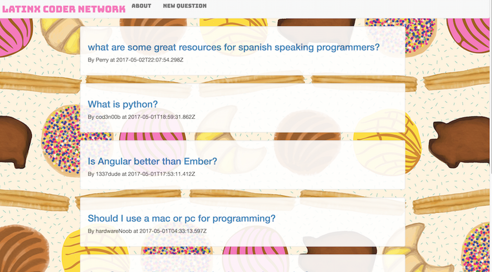
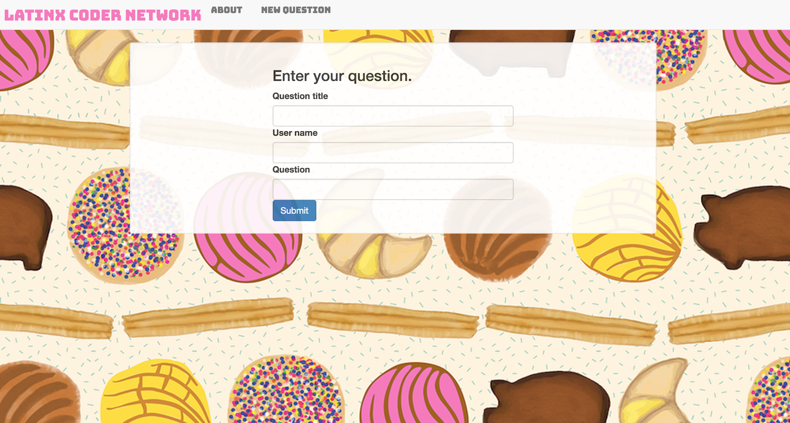

# Message Board - Latinx Coder Network
#### _Epicodus Friday Project, 4-28-2017_
The Latinx Coder Network message board is a web app in the vein of [Stack Overflow](http://stackoverflow.com/) or [Ask Reddit](https://www.reddit.com/r/AskReddit/). Users will have the ability to enter a question for other users to answer. Questions are ordered on the home page from most to least recent. Users can comment on existing questions by navigating to that specific question's page.

**The goal of having a a latinx specific programming question and answer website is to make tech and programming more visible and accessible to [latinx](http://www.complex.com/life/2016/04/latinx/) people.**

## Prerequisites

You will need the following things properly installed on your computer.

* [Git](https://git-scm.com/)
* [Node.js](https://nodejs.org/) (with NPM)
* [Bower](https://bower.io/)
* [Ember CLI](https://ember-cli.com/)
* [PhantomJS](http://phantomjs.org/)

## Installation

* Clone this repository
* Make sure to navigate to the 'message-board' file in your terminal
* Run the command `npm install`
*  Run the command `bower install`

## Running / Development

* Type `ember serve` into your terminal
* Visit your app at [http://localhost:4200](http://localhost:4200).
